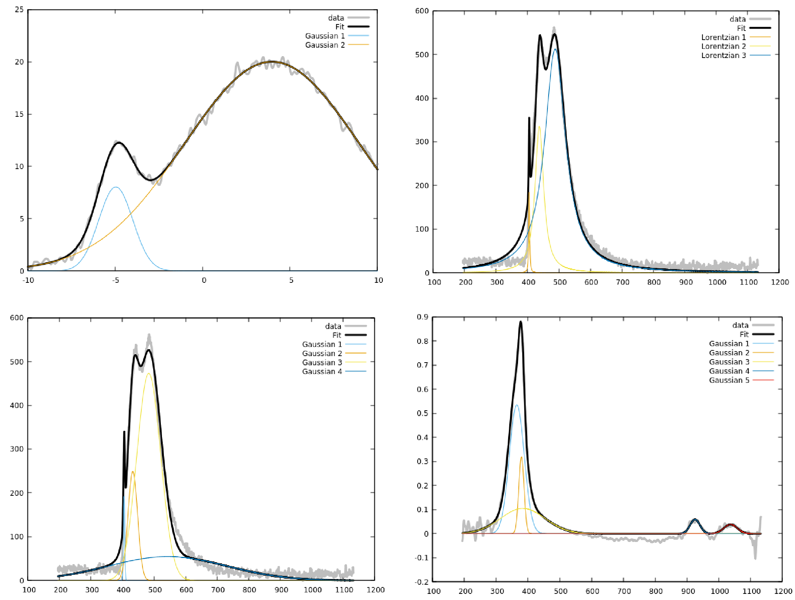

# gaussfit

Command line utility and library to decompose spectra in gaussians and lorentzians, easily used for automatic processing of multiple similar spectra. Minimum dependencies and written in C. Tested only on Linux, but should work on other POSIX-compliant systems.

Building:

			make

External dependencies:

			Standard C libs.
			C compiler and make (to build).
			gnuplot on path and /dev/shm mounted (optional, for option -p to work. If this are not present the other options will work with no modification.)

See tests.sh for examples. Example for usage in C code is in file demo_gaussfit_api.c.

			Usage:
			 ./gaussfit [-p] [-m] [-a] [-g A=XX,sigma=XX,mu=XX] [-g A=XX,sigma=XX,mu=XX] [-f file]

			   -w X  File save mode.
						 X=0-> Don't save results (default).
						 X=1-> Saves final fit parameters
						       (filename.gaussfit).
						 X=2-> Saves final fit parameters
						       and spectrum with boxcar and
						       baselined removed (filename.gaussfit
						       and filename.proc).
			   -b X  Baseline polynomial order (X is an integer).
			   -s X  Boxcar smoothing (X is an integer).
			   -p    Plot graph and gaussians with gnuplot.
					 Gnuplot must be installed and on path
					 for this option to be used.
			   -m    Manualy specify gaussians/Lorentzians initial
					 guess with option -g or -l. Must not be used
					 together with option -a.
			   -a rth=0.2,tyf=1,nt=95,faf=0.95,risaf=1.1
						Automaticaly set gaussians initial guess. Parameters:
						tyf:0 for gaussian and 1 for lorentzian.
						nt: Noise tolerance, larger means less sensitive to noise.
						rth: Minimum height to consider a peak, between 0 and 1.
						faf: Minimum fall after peak before adding another peak.
						risaf: Minimum rise after minimum before adding another peak.
			   -g A=XX,sigma=XX,mu=XX
					 Set gaussians initial guess, where XX are
					 float point values. Options -g or -l must
					 be used if option -m is used. 
			   -l A=XX,sigma=XX,mu=XX
					 Set Lorentzian initial guess, where XX are
					 float point values. Options -g or -l must
					 be used if option -m is used. 
			   -f file
					 Set file containing data to
					 be fitted. Must be used.

